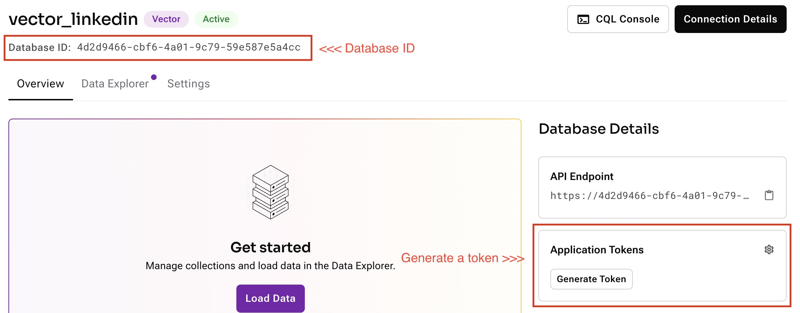

# Shakespeare sample application for DataStax Python driver

<table>
<tr>
<td> 1. Let the environment finish running the pip install command.
</td>
<td> See terminal below
</td>
</tr>

<tr>
<td valign=top> 2. Get an Astra account/database at https://astra.datastax.com
</td>
<td> 
</td>
</tr>

<tr>
<td valign=top> 3. Get your DB ID and Token
</td>
<td> 
</td>
</tr>

<tr>
<td valign=top> 4. Sign up at openai.com and get an API key
</td>
<td> http://openai.com
</td>
</tr>

<tr>
<td valign=top> 5. Populate an .env file with the items from the previous steps.
</td>
<td> <pre>
OPENAI_API_KEY=<key>
ASTRA_DB_APPLICATION_TOKEN=<token>
ASTRA_DB_ID=<id>
</pre>
</td>
</tr>

<tr>
<td valign=top> 6. Run the population command with `python populate.py` to get the answer
</td>
<td> <pre>
python populate.py
</pre>
</td>
</tr>
</table>
